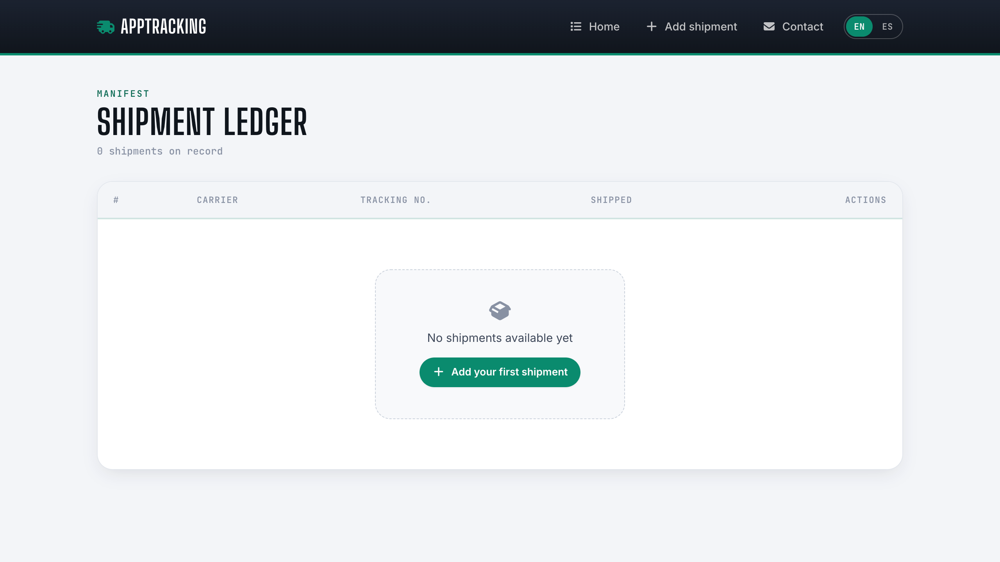
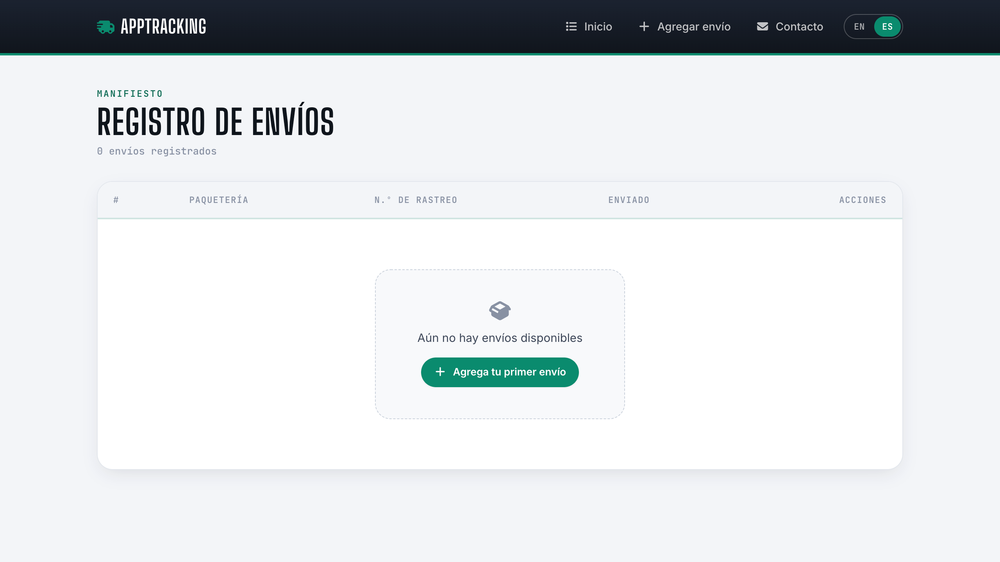
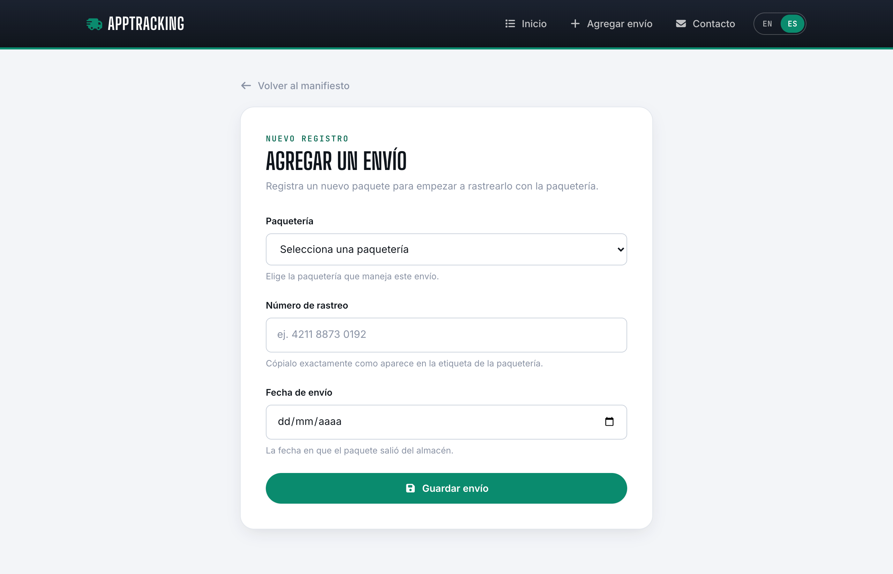
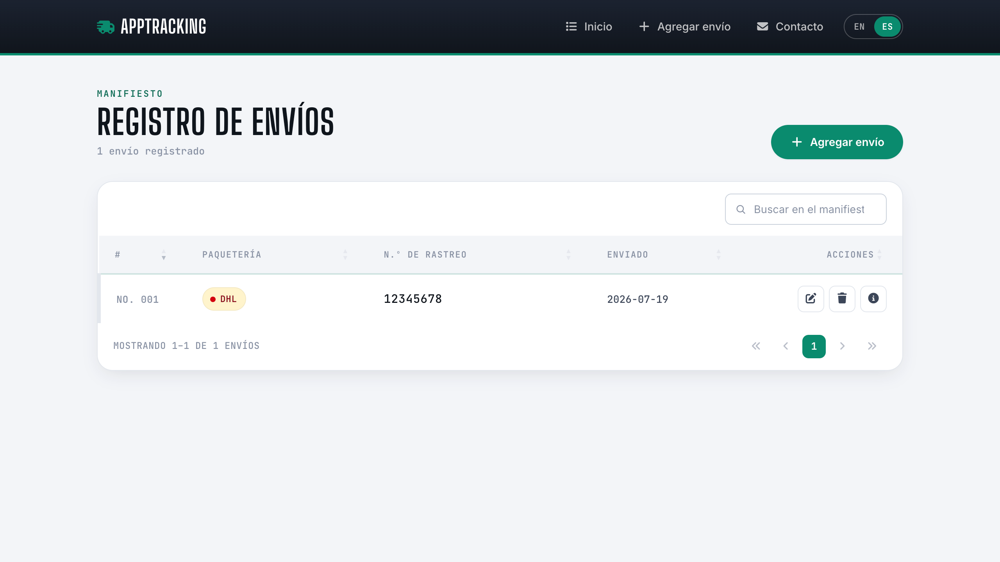
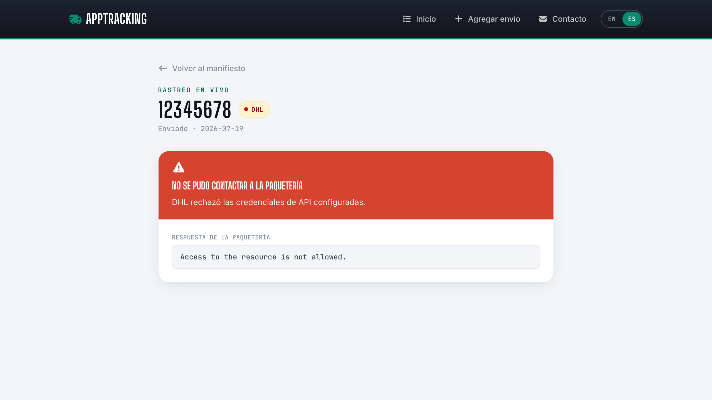
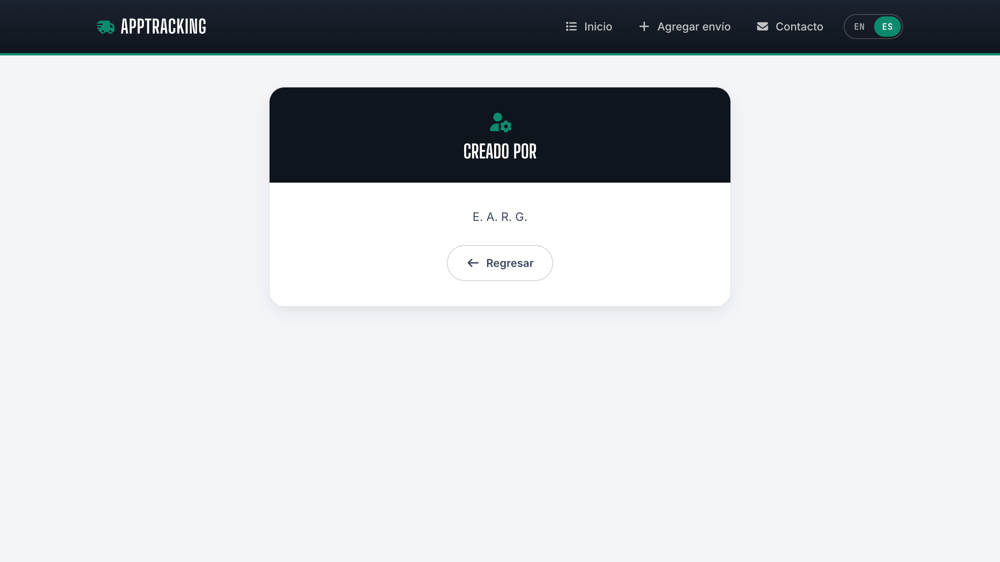

<div align="center">

# AppTracking

**Registra un envío y síguele la pista sin rodeos.**


</div>

<br>

Aplicación web para registrar paquetes y consultar su estado de entrega. Soporta rastreo en vivo con **DHL** y **99minutos**.

Desarrollada con Node.js, Express, MongoDB y vistas EJS.

## Características

- Registro, edición y eliminación de envíos.
- Lista general con opciones de búsqueda, ordenamiento y paginación.
- Rastreo en vivo (estado, fecha estimada e historial) para DHL y 99minutos.
- Manejo de errores detallado si falla la API de alguna paquetería.
- Soporte multiidioma (español e inglés) que recuerda tu preferencia.
- Diseño responsivo para móvil y escritorio.

## Requisitos

- Node.js y npm.
- MongoDB (local o Atlas).
- Claves de API de DHL o 99minutos para el rastreo en vivo.

## Instalación

```bash
git clone <repository-url>
cd AppTracking
npm install
```

## Configuración

Crea tu archivo de configuración copiando el ejemplo:

```bash
cp .env.example .env
```

Llena las variables en `.env` con tus credenciales de base de datos y de las paqueterías.

## Ejecución

Inicia el servidor en modo desarrollo:

```bash
npm start
```

La aplicación estará disponible en: [http://localhost:3000](http://localhost:3000)

## Capturas de pantalla

<table>
<tr>
<td align="center" width="50%">
<br>
<sub><strong>Manifiesto — inglés</strong></sub>
</td>
<td align="center" width="50%">
<br>
<sub><strong>Manifiesto — español</strong></sub>
</td>
</tr>
<tr>
<td align="center">
<br>
<sub><strong>Agregar un envío</strong></sub>
</td>
<td align="center">
<br>
<sub><strong>Envío registrado en el manifiesto</strong></sub>
</td>
</tr>
<tr>
<td align="center">
<br>
<sub><strong>Rastreo en vivo</strong></sub>
</td>
<td align="center">
<br>
<sub><strong>Contacto</strong></sub>
</td>
</tr>
</table>

## Estructura del proyecto

```
app.js              # Archivo principal de la aplicación
config/             # Conexión a base de datos e idioma
routes/             # Rutas web y de API
controllers/        # Lógica de los controladores
models/             # Esquemas de MongoDB (Mongoose)
utils/              # Helpers (OAuth, manejo de errores de APIs, etc.)
locales/            # Archivos de traducción (ES / EN)
views/              # Plantillas EJS
```
